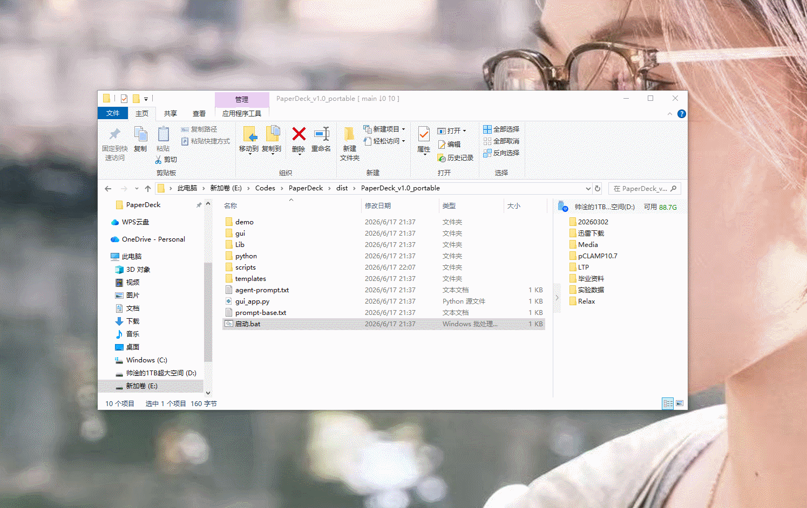
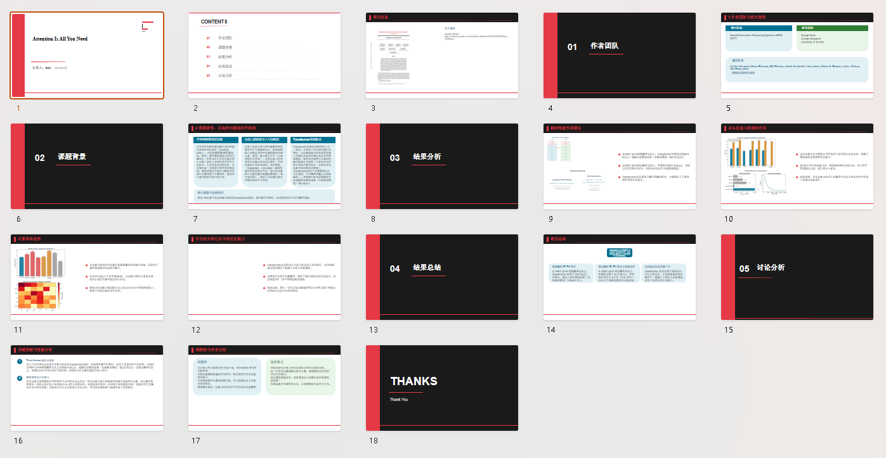
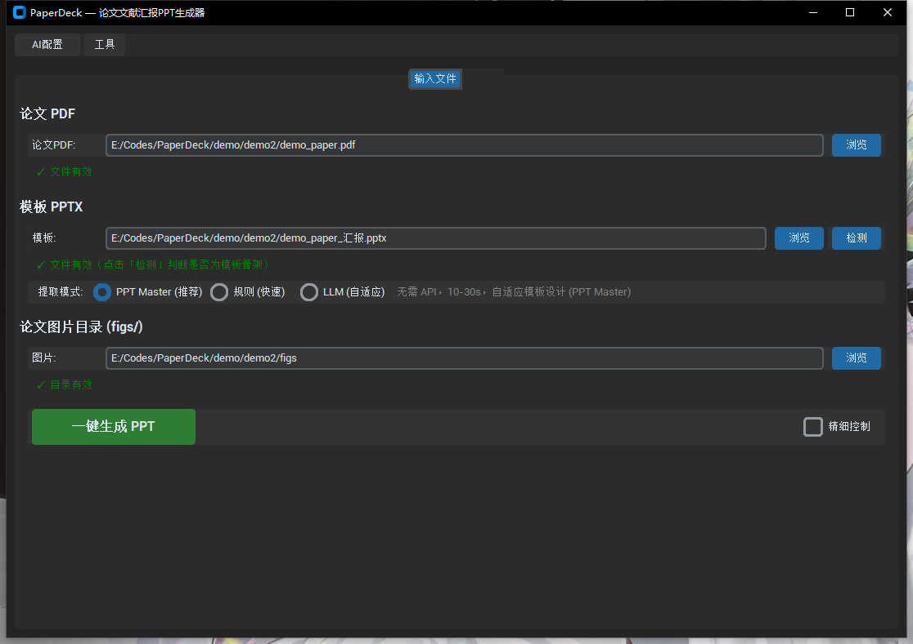
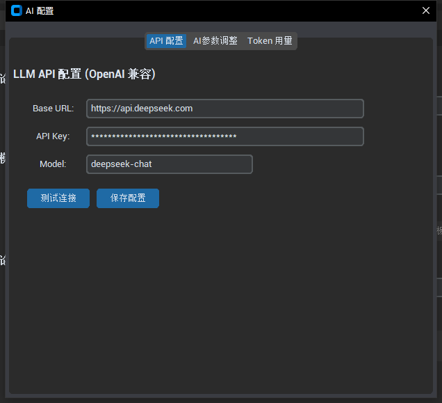
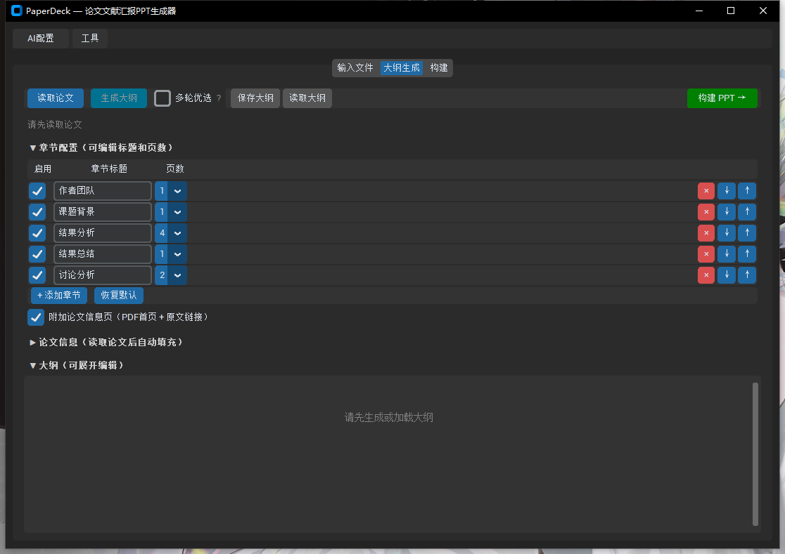
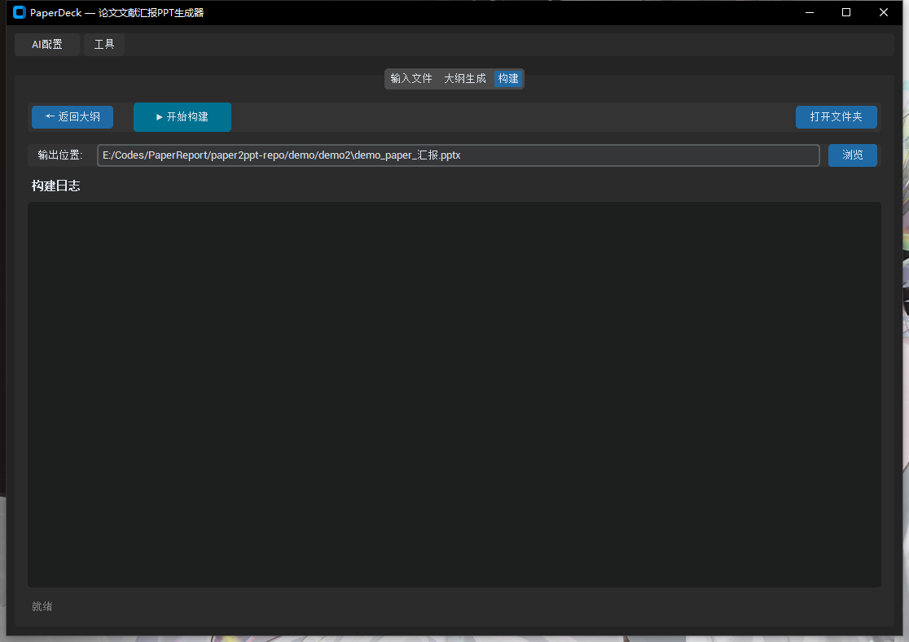

# PaperDeck

> 📄 论文 PDF → 双击启动 → 一键生成汇报 PPT。**不需要写代码，不需要装 Python。**



---

## 👥 这个工具适合你吗？

### ✅ 如果你符合以下情况

| | |
|---|---|
| 🎓 **学生 / 研究者** | 每周组会要汇报文献，手工做 PPT 太耗时 |
| 🔬 **技术爱好者** | 想用 AI 自动提取论文要点，快速搭出汇报框架 |
| ⏱️ **追求效率的人** | 希望 3 分钟搞定一份结构完整的汇报初稿 |

### 典型使用场景

1. **快速完成文献汇报** — 输入一篇论文 PDF，自动生成带封面、背景、结果、讨论的完整幻灯片
2. **用 AI 汲取灵感** — LLM 帮你归纳论文要点，你可能没想到的角度它帮你补上
3. **搭建框架再精修** — 先生成初稿 PPT，再在 PowerPoint 里逐页调整细节

### ⚠️ 不适用的场景

- ❌ 需要 100% 准确、可直接交付的正式汇报（AI 生成内容**必须人工审核**）
- ❌ 高度定制化的设计需求（布局由模板决定，不支持自由排版）
- ❌ 非 PDF 格式的论文（目前仅支持 PDF 输入）

---

## 🚀 快速开始（3 分钟）

> 以 demo2 为例：[Attention Is All You Need](https://arxiv.org/abs/1706.03762) 论文 → 生成汇报 PPT。



### 准备工作

| 你需要 | 说明 | 从哪里来 |
|--------|------|---------|
| 📄 论文 **PDF** | 你要汇报的论文 | 知网 / arXiv / 期刊官网 |
| 📊 模板 **PPTX** | 实验室/课题组的汇报模板 | 导师或实验室发你的 |
| 🔑 **API Key** | DeepSeek 等 OpenAI 兼容接口 | [platform.deepseek.com](https://platform.deepseek.com) 等 |
| 🖼️ 图片文件夹（可选） | 论文中的插图截图 | PDF 截图，按 Figure 编号命名 |

<details>
<summary>📸 图片文件夹命名规则（点击展开）</summary>

```
figs/
├── 1A.jpg          ← 图 1 的 A 子图
├── 1DEF.jpg        ← 图 1 的 D+E+F 合并
├── 2BC.jpg         ← 图 2 的 B+C 合并
└── 5ABCD.jpg       ← 图 5 的 A+B+C+D 合并
```

LLM 会自动将图片分配到对应的结果页中。

</details>

### 操作步骤



| 步骤 | 操作 | 说明 |
|:--:|------|------|
| ① | **设置 AI 模型** | 点击右下角「AI 配置」→ 填入 API Key → 选择模型（推荐 `deepseek-chat`）→ 测试连接 |
| ② | **选择文件** | 选择论文 PDF + 模板 PPTX（可选：图片文件夹） |
| ③ | **一键生成** | 点击绿色「**一键生成 PPT**」按钮，等待 30-90 秒 |
| ④ | **保存** | 点击「点击保存 PPT」→ 选择保存位置 → 自动打开 |



### 精细控制（可选）

勾选「☑ 精细控制」后，可以分两步操作：



**第 1 步 — 生成大纲（Outline）**：读取论文 → 编辑章节配置 → 生成大纲 → 检查/修改内容 → 手动分配图片



**第 2 步 — 构建 PPT（Build）**：验证 JSON → 开始构建 → 打开输出文件

---

## 🔌 支持的 AI 模型

PaperDeck 本身**不包含大模型**，你需要提供 OpenAI 兼容的 API。以下平台实测可用：

| 平台 | 价格参考 | 获取地址 |
|------|---------|---------|
| DeepSeek ✅ | ¥1/百万 token | [platform.deepseek.com](https://platform.deepseek.com) |
| SiliconFlow | 有免费额度 | [siliconflow.cn](https://siliconflow.cn) |
| 火山方舟 | 有免费模型 | [console.volcengine.com/ark](https://console.volcengine.com/ark) |

> 💡 **其他兼容 OpenAI 接口的模型理论上都能用**，但未经全面测试。如有问题欢迎提 Issue。

---

## 🎨 模板提取模式

不同模板需要不同的提取策略，我们支持三种模式：

| 模式 | 速度 | 适用场景 | 需要 API？ |
|------|:--:|------|:--:|
| **PPT Master**（推荐） | 10-30s | 大多数模板，主题色/字体精准 | ❌ 不需要 |
| 规则匹配 | 瞬间 | 结构标准、简单的模板 | ❌ 不需要 |
| LLM 提取 | 10-30s | 复杂模板，AI 自适应分析 | ✅ 需要 |

---

## ❓ 常见问题

<details>
<summary><strong>生成的结果不对怎么办？</strong></summary>

AI 生成的内容不能保证 100% 准确。建议：
1. 使用「精细控制」模式，在生成大纲后逐页检查修改
2. 生成后在 PowerPoint 中手动调整
3. 如果某页内容完全不相关，可以只修改该页重新生成

</details>

<details>
<summary><strong>API 报错 / 连接失败？</strong></summary>

1. 检查 API Key 是否正确（注意不要有多余的空格）
2. 确认账户余额充足
3. 检查网络是否能访问对应平台（部分平台需要国内网络）
4. 点击「AI 配置」中的「测试连接」按钮验证

</details>

<details>
<summary><strong>支持哪些论文语言？</strong></summary>

目前主要针对英文论文优化。中文论文也能用，但效果可能不如英文论文稳定。

</details>

<details>
<summary><strong>支持 Mac 吗？</strong></summary>

目前仅提供 Windows 便携包。Mac 用户可以从源码运行（需要 Python 3.10+）：

```bash
pip install -r requirements-gui.txt
python gui/app.py
```

</details>

<details>
<summary><strong>模板 PPTX 有什么要求？</strong></summary>

- `.pptx` 格式（PowerPoint 2007 及以上）
- 建议包含封面页、内容页、致谢页等标准页面
- 颜色和字体尽量使用主题色/主题字体（PPT Master 模式提取效果更好）

</details>

<details>
<summary><strong>生成的 PPT 可以二次编辑吗？</strong></summary>

可以。输出的是标准 `.pptx` 文件，用 PowerPoint / WPS / Google Slides 都能打开和编辑。

</details>

---

## ⚠️ 风险提示 & 版权

### AI 生成内容

- 本工具使用 LLM 自动生成 PPT 内容，**不保证信息的准确性、完整性或时效性**
- 所有 AI 生成的内容**必须经过人工审核**后方可用于正式场合
- 使用者对最终 PPT 的内容质量负全部责任

### 论文版权

- 本工具处理的论文 PDF 应为用户**合法获取**的文献
- 生成的 PPT 仅供个人学习、研究、交流使用
- **不得**将生成的 PPT 用于商业目的（除非你拥有论文和模板的相应授权）
- 使用受版权保护的论文时，请在 PPT 中标注引用来源

### API 费用

- 使用 LLM 模式（大纲生成、模板提取等）将消耗 API 调用额度
- API 费用由用户自行承担，与 PaperDeck 项目无关
- 建议使用前确认你的 API 账户余额

---

## 📂 项目结构（给开发者）

```
scripts/                  核心逻辑
  llm_template_extract.py   LLM 模板提取
  ppt_builder.py            PPT 构建引擎
  ppt_layout.py             幻灯片布局
  ppt_slides.py             幻灯片类型定义
  paper_metadata.py         论文元数据提取
  vendor/pptmaster/         内置 ppt-master 工具集
gui/                       GUI 界面（customtkinter）
  pages/                    各页面（配置、大纲、构建）
  widgets/                  组件（大纲编辑器、AI 配置弹窗等）
demo/
  demo1/                    AST-LLM 论文示例
  demo2/                    Attention Is All You Need 示例
test/                      测试用例
```

---

## 📄 License

MIT © [MoonstarWng](https://github.com/MoonstarWng)
